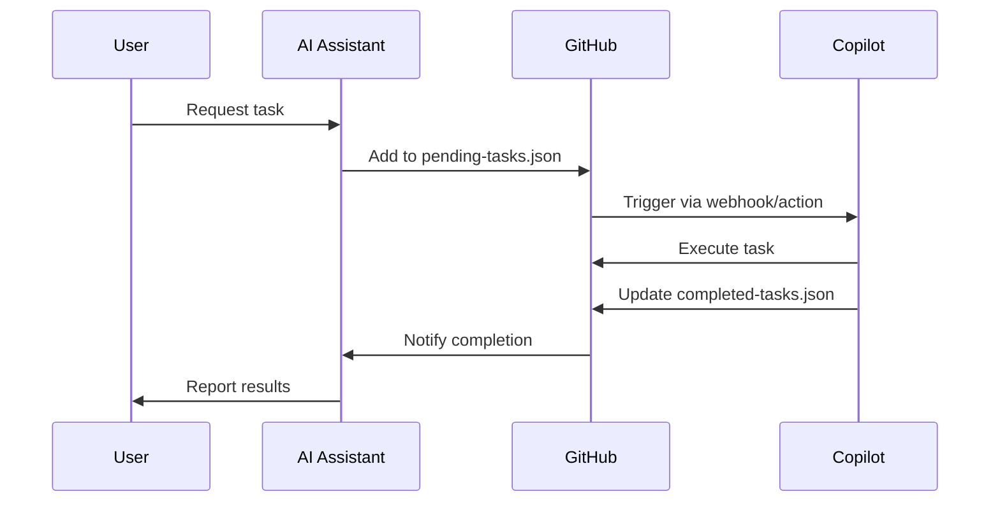

# 🤖 AI-Copilot Integration Guide
# دليل تكامل المساعد الذكي مع Copilot

## 📖 Overview / نظرة عامة

This guide explains how to use the AI-Copilot integration system for the astro-blog-starter-template repository.

هذا الدليل يشرح كيفية استخدام نظام التكامل بين المساعد الذكي و Copilot لمشروع Astro Blog.

---

## 🎯 What This System Does / ماذا يفعل هذا النظام

The system allows an AI assistant (like Comet) to:
- Communicate tasks to GitHub Copilot
- Automate code generation and modifications
- Track task execution and completion
- Follow established coding standards and rules

النظام يسمح للمساعد الذكي بـ:
- التواصل مع GitHub Copilot لتنفيذ المهام
- أتمتة كتابة وتعديل الكود
- تتبع تنفيذ المهام وإكمالها
- اتباع معايير البرمجة المحددة

---

## 📂 System Architecture / هيكل النظام

### Core Files / الملفات الأساسية

```
.copilot/
├── README.md                 # System documentation
├── config.json              # Configuration settings
├── instructions.md          # Usage instructions
├── rules.md                 # Coding guidelines
├── pending-tasks.json       # Tasks queue
└── completed-tasks.json     # Completed tasks log

.github/workflows/
└── copilot-executor.yml     # GitHub Actions automation
```

---

## 🚀 How to Use / كيفية الاستخدام

### Method 1: Direct Communication Pattern / طريقة التواصل المباشر

Use these commands when interacting with the AI assistant:

#### **@copilot execute**
Execute automated tasks
```
@copilot execute: create a new blog post component in src/components/
```

#### **@copilot analyze**
Perform code analysis
```
@copilot analyze: check for unused imports in the entire project
```

#### **@copilot file**
File operations
```
@copilot file: create src/pages/blog/post-1.md with sample content
```

#### **@copilot test**
Run tests
```
@copilot test: run all unit tests and report coverage
```

#### **@copilot refactor**
Code improvements
```
@copilot refactor: optimize the Header component for better performance
```

### Method 2: Task Queue System / نظام قائمة المهام

The AI assistant adds tasks to `.copilot/pending-tasks.json`:

```json
{
  "version": "1.0",
  "tasks": [
    {
      "id": "task-001",
      "timestamp": "2025-12-18T16:00:00Z",
      "type": "create",
      "description": "Create a new About page",
      "details": {
        "file": "src/pages/about.astro",
        "requirements": [
          "Use BaseLayout",
          "Add RTL support",
          "Include SEO meta tags"
        ]
      },
      "priority": "high",
      "status": "pending"
    }
  ]
}
```

GitHub Copilot (via extension or Actions) processes the task and logs results in `completed-tasks.json`.

---

## 📋 Task Types / أنواع المهام

| Type | Description | Example |
|------|-------------|----------|
| `create` | Create new files | Create component |
| `modify` | Update existing files | Update function |
| `fix` | Fix bugs | Fix rendering issue |
| `refactor` | Improve code structure | Optimize performance |
| `test` | Add/run tests | Add unit tests |
| `document` | Generate documentation | Create API docs |
| `analyze` | Code analysis | Security scan |

---

## ⚙️ Configuration / الإعدادات

### Main Config (`.copilot/config.json`)

Key settings:

```json
{
  "ai_assistant": {
    "enabled": true,
    "auto_execute": false,      // Requires manual approval
    "require_approval": true
  },
  "commands": {
    "execute": {
      "enabled": true,
      "allowed_operations": [
        "file_create",
        "file_update",
        "file_delete"
      ]
    }
  },
  "security": {
    "scan_dependencies": true,
    "check_vulnerabilities": true
  }
}
```

### Custom Rules (`.copilot/rules.md`)

Defines:
- Code quality standards
- Naming conventions
- Astro-specific guidelines
- Security requirements
- Testing requirements
- Documentation standards

---

## 🔐 Security / الأمان

### ⚠️ Important Security Notes:

1. **No Sensitive Data**: Never include API keys, passwords, or tokens in task files
2. **Manual Review**: Always review AI-generated changes before committing
3. **Approval Required**: Deployment and security changes require manual approval
4. **Access Control**: Limit who can modify `.copilot/` configuration

### Prohibited Actions:
- Automatic deployments without approval
- Modifying security settings
- Deleting files without confirmation
- Committing without running tests

---

## 💡 Examples / أمثلة

### Example 1: Create a New Component

**User Request:**
```
@copilot execute: create a BlogCard component with props for title, excerpt, and date
```

**Expected Result:**
- File created: `src/components/BlogCard.astro`
- Props properly typed
- Tailwind CSS styling applied
- RTL support included

### Example 2: Fix a Bug

**User Request:**
```
@copilot fix: Arabic text is not displaying right-to-left in the Header component
```

**Expected Result:**
- Header component updated
- `dir="rtl"` attribute added where needed
- CSS adjustments for RTL

### Example 3: Generate Documentation

**User Request:**
```
@copilot document: create API documentation for all utility functions in src/lib/
```

**Expected Result:**
- Documentation file created
- All functions documented with JSDoc
- Usage examples included

---

## 🔄 Workflow / سير العمل



---

## 🛠️ Troubleshooting / حل المشاكل

### Problem: Task not executing
**Solutions:**
- Verify JSON syntax is valid
- Check `status` is set to `pending`
- Review GitHub Actions logs
- Ensure Copilot extension is active

### Problem: Wrong output generated
**Solutions:**
- Review `.copilot/rules.md` for guidelines
- Provide more specific task details
- Check completed-tasks.json for error messages

### Problem: File conflicts
**Solutions:**
- Use unique task IDs
- Sync with repository before adding tasks
- Review git status before committing

---

## 📊 Monitoring / المراقبة

### Check Task Status:

1. View pending tasks:
   ```bash
   cat .copilot/pending-tasks.json
   ```

2. View completed tasks:
   ```bash
   cat .copilot/completed-tasks.json
   ```

3. Check GitHub Actions:
   - Navigate to Actions tab
   - View "Copilot Executor" workflow runs

---

## 🎓 Best Practices / أفضل الممارسات

1. **Be Specific**: Provide detailed task descriptions
2. **One Task at a Time**: Don't overload the queue
3. **Review Changes**: Always review before merging
4. **Follow Rules**: Adhere to `.copilot/rules.md` guidelines
5. **Test First**: Run tests after changes
6. **Document**: Keep documentation up to date

---

## 🔗 Integration Points / نقاط التكامل

The system integrates with:

- ✅ **GitHub API**: For reading/writing files
- ✅ **GitHub Actions**: For automation
- ✅ **VS Code Extensions**: For local development
- ✅ **Webhooks**: For real-time notifications

---

## 📝 Task Priority Levels / مستويات الأولوية

| Priority | Description | Response Time |
|----------|-------------|---------------|
| `critical` | Security fixes, production bugs | Immediate |
| `high` | Feature requests, important fixes | < 1 hour |
| `medium` | Improvements, refactoring | < 4 hours |
| `low` | Documentation, cleanup | < 24 hours |

---

## 🌐 Language Support / دعم اللغات

The system supports:
- English (primary)
- Arabic (عربي)

Both languages can be used in:
- Task descriptions
- Comments
- Documentation
- Commit messages

---

## 📚 Additional Resources / موارد إضافية

- [Astro Documentation](https://docs.astro.build)
- [GitHub Copilot Docs](https://docs.github.com/copilot)
- [GitHub Actions Guide](https://docs.github.com/actions)

---

## 🆘 Support / الدعم

For issues or questions:
1. Check `.copilot/README.md`
2. Review this guide
3. Check GitHub Issues
4. Contact repository maintainers

---

**Created by**: AI Assistant (Comet)
**Last Updated**: 2025-12-18
**Version**: 1.0.0
**Repository**: [Al3mda/astro-blog-starter-template](https://github.com/Al3mda/astro-blog-starter-template)
